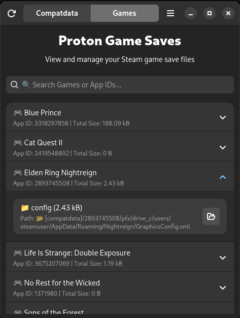
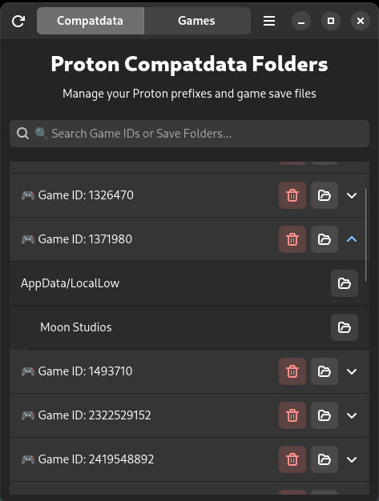

# Proton Game Saves Manager


A GTK4 application written in Rust to manage Proton game save files for Steam games running through Proton compatibility layer.

## Screenshots





## Features

- Browse and manage Proton prefix folders
- Easily navigate to save file locations for each game
- Delete unwanted prefixes
- Configure Steam directory location
- Modern GTK4/libadwaita UI following GNOME HIG

## Installation

### From AUR (Arch Linux) - Recommended

```bash
paru -S proton-game-saves
# or
yay -S proton-game-saves
```

The AUR package is automatically updated when new releases are published.

### Building from source

#### Dependencies

- Rust and Cargo
- GTK4 and libadwaita development libraries

Clone this repository and build with Cargo:

```
git clone https://github.com/rahatzamancse/protongamesaves.git
cd protongamesaves
cargo build --release
```

The compiled binary will be located at `target/release/proton_game_saves`.

## Usage

Run the application:

```
./target/release/proton_game_saves
```

When first started, the application will try to use the default Steam location (`~/.steam`). If your Steam installation is in a different location, click on the menu and select "Settings" to configure the correct path.

The application shows the list of Proton prefix folders (identified by their Steam App ID). You can:
- Click the "Open drive_c Folder" button to open that game's drive_c folder in your file manager
- Click the "Delete Prefix" button to remove a prefix
- Expand a game entry to view save locations
- Click "Open" buttons to navigate to specific save folders

## Save Locations

The application scans for saves in these standard locations:

- AppData/Local
- AppData/LocalLow
- AppData/Roaming
- Documents
- Saved Games

Certain directories are ignored by default:
- Microsoft
- Temp
- Packages
- ConnectedDevicesPlatform
- Comms
- Apps

## License

This project is licensed under the GNU GPL-3.0 license. 